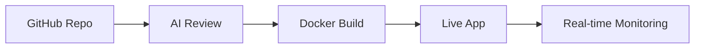

# Shard - AI-Powered Deployment Platform

**Deploy. Review. Scale.** - A Vercel-like platform with AI code review that turns your GitHub repos into live applications in seconds.

## What Makes Shard Special

**AI Code Guardian** - Every deployment gets a security & quality review before going live  
**One-Click Deploy** - GitHub to Live App in under 60 seconds  
**Enterprise Security** - Encrypted environment variables, JWT auth, OAuth integration  
**Real-Time Everything** - Live deployment logs, progress tracking, performance metrics  
**Smart Containers** - Auto-scaling Docker deployments with unique subdomains  

## Perfect For

- **Enterprise Teams** shipping applications with confidence
- **Development Organizations** needing reliable deployment without DevOps complexity  
- **Companies** requiring AI-powered code quality gates
- **Teams** seeking automated deployment workflows

## Tech Stack Support

| Framework | Port | Status |
|-----------|------|--------|
| **MERN Stack** | 12000 | Full Support |
| **Django** | 13000 | Full Support |  
| **Flask** | 14000 | Full Support |

Each deployment gets: `your-app-name.localhost:port` with SSL, health monitoring, and auto-restart.

## How It Works

1. **Connect GitHub** - OAuth integration, instant repo access
2. **AI Reviews Your Code** - Security, quality, best practices check
3. **Auto-Deploy** - Docker containers with environment injection
4. **Monitor Live** - Real-time logs, metrics, health checks

## Architecture

**Microservices Design** for maximum reliability:

- **React Frontend** - Modern dashboard with real-time updates
- **Node.js API** - JWT auth, MongoDB, environment encryption  
- **Python AI Service** - Code analysis, security scanning
- **Docker Worker** - Container orchestration, deployment pipeline
- **Nginx Proxy** - Dynamic subdomain routing, SSL termination

## Security First

- **JWT Authentication** with refresh tokens
- **OAuth Integration** (GitHub, Google)  
- **Encrypted Environment Variables** at rest
- **AI Security Scanning** for vulnerabilities
- **Rate Limiting** and DDoS protection
- **Complete Audit Trails** for all operations

## Built to Scale

- **Horizontal Scaling** - Stateless API design
- **Docker Optimization** - Layer caching, resource limits
- **Performance Monitoring** - CPU, memory, network tracking
- **Auto-Recovery** - Container health checks, automatic restarts

## Modern Developer Experience  

- **Sharp Design System** - 2px borders, clean typography
- **Real-Time Updates** - WebSocket deployment progress
- **Comprehensive Logs** - Debug faster with detailed logging
- **API Documentation** - Interactive examples and guides

## What You Get

**Instant Deployments** - From commit to live in seconds  
**AI Code Reviews** - Catch issues before they hit production  
**Environment Management** - Secure, encrypted variable storage  
**Real-Time Monitoring** - Live logs, metrics, alerts  
**Custom Subdomains** - Professional URLs for every project  
**Auto-Scaling** - Handle traffic spikes automatically  

---

## License

**Creative Commons Attribution-NonCommercial-NoDerivatives 4.0 International (CC BY-NC-ND 4.0)**

This work is licensed under restrictive Creative Commons license:
- **Share** - Copy and redistribute the material
- **No Commercial Use** - Cannot be used for commercial purposes  
- **No Derivatives** - Cannot remix, transform, or build upon the material
- **Attribution Required** - Must give appropriate credit

[View Full License](https://creativecommons.org/licenses/by-nc-nd/4.0/)

---

*Built with love and dedication for developers who want to ship fast without compromising on quality.*
